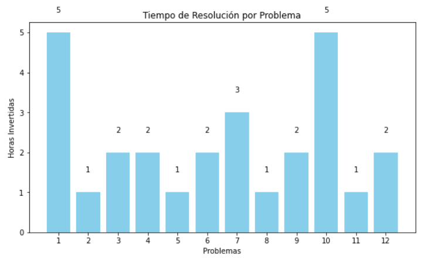
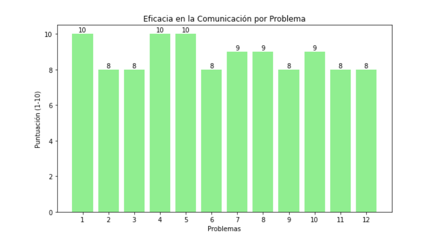
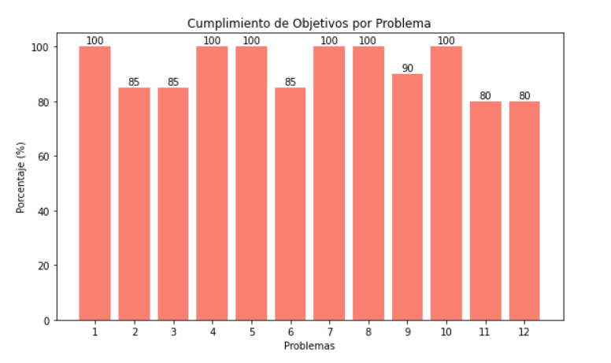

# Problemas encontrados
## Ingeniería del Software y Práctica Profesional (ISPP)

### Grupo 3: Eventbride

### Miembros:
- Francisco Avilés Carrera
- Daniel Benito Hidalgo
- Ignacio Blanquero Blanco
- Adrián Cabello Martín
- María de la Salud Carrera Talaverón
- Pablo Jesús Castellanos Compaña
- Fernando José de Celis Hurtado
- David Godoy Fernández
- Miguel Hernández Sánchez
- Antonio Montero López
- Gonzalo Navas Remmers
- Héctor Noguera González
- Natalia Olmo Villegas
- Manuel Pérez Vélez
- Andrés Pizzano Cerrillos
- Sergio Pons López
- Lorenzo Torralba Lanzas

### Fecha: 10/04/2025

### Entregable: Sprint 3

---

### Historial de versiones

| Fecha      | Versión | Descripción                                | Entrega  | Contribuyente(s)                    |
|------------|---------|--------------------------------------------|----------|-------------------------------------|
| 03/03/2025 | v1.0    | Creación del documento y redacción del problema 1 | Sprint 1 | Ignacio Blanquero Blanco |
| 06/03/2025 | v1.1    | Redacción del problema 2 | Sprint 1 | Ignacio Blanquero Blanco |
| 10/03/2025 | v1.2    | Redacción del problema 3 | Sprint 1 | Ignacio Blanquero Blanco |
| 19/03/2025 | v1.3    | Redacción del problema 4 | Sprint 2 | Héctor Noguera González |
| 25/03/2025 | v1.4    | Redacción del problema 5 | Sprint 2 | Héctor Noguera González |
| 02/04/2025 | v1.5    | Redacción del problema 6 y 7 | Sprint 3 | Héctor Noguera González |
| 09/04/2025 | v1.6    | Redacción del problema 8 y 9 | Sprint 3 | Héctor Noguera González |
| 10/04/2025 | v1.7    | Redacción del problema 10, 11 y 12 | Sprint 3 | Héctor Noguera González |

---

## Contenido
1. [Introducción](#intro)
2. [Problema 1: Problema de Integración de JWT en Funcionalidades de Login y Registro](#id1)
3. [Problema 2: Diversidad en los grupos de trabajo y dificultad de horarios](#id2)
4. [Problema 3: Alcance excesivo](#id3)
5. [Problema 4: Cambios en los mismos archivos](#id4)
6. [Problema 5: Actualización del pom.xml para añadir correos](#id5)
7. [Problema 6: Falta de coordinación, comunicación y priorización en la entrega de tareas](#id6)
8. [Problema 7: Inconsistencias en la ejecución del backend debido al límite de tamaño de fila en la base de datos](#id7)
9. [Problema 8: Caída del despliegue en Google Cloud por falta de créditos](#id8)
10. [Problema 9: Imposibilidad de rellenar invitaciones tras mejora en la seguridad del sistema](#id9)
11. [Problema 10: Seguridad deficiente en rutas internas de la aplicación](#id10)
12. [Problema 11: Tareas no movidas a "Done" en el Kanban de GitHub Projects](#id11)
13. [Problema 12: Retrasos en la documentación general del proyecto](#id12)
14. [Rendimiento y Evaluación de Acciones](#Rendimiento)
15. [Conclusiones](#conclusiones)
16. [Bibliografía](#bib)

## Introducción

En el presente documento se exponen de manera detallada los problemas identificados durante el proceso de desarrollo.

## Problema 1: Problema de Integración de JWT en Funcionalidades de Login y Registro

### Trazabilidad del problema:

El problema fue diagnosticado el martes 4 de marzo de 2025 por María de la Salud Carrera, quien, al trabajar en la implementación de la funcionalidad de la feature 67 “navbar”, identificó que los formularios de inicio de sesión (login) y registro de usuarios (register) no funcionaban correctamente. Ante esta situación, se creó una propuesta de cambio titulada “[Change] Arreglar login y sign in”. En esta tarea fueron asignados los miembros del equipo María de la Salud Carrera, Daniel Benito, Adrián Cabello y Pablo Jesús Castellanos, con el objetivo de solucionar los problemas relacionados con el uso del JWT en estas funcionalidades.

La issue de tipo “change” se creó en la tarde del 4 de marzo de 2025, y el equipo comenzó a trabajar en la resolución del problema a lo largo de esa tarde y parte de la noche. Durante este proceso, se revisaron otros proyectos previos, se visualizaron recursos formativos y se generaron controladores y servicios nuevos para abordar el inconveniente. Finalmente, tras realizar algunos ajustes en el frontend y realizar las correcciones necesarias, el problema se resolvió al mediodía del 5 de marzo de 2025.

### Estado del problema

El problema ha sido solucionado con éxito, y tanto la funcionalidad de inicio de sesión como la de registro de usuario están operativas. Además, la resolución del problema requirió un tiempo total de 15 horas, desde la notificación inicial hasta la corrección definitiva.

### Lecciones aprendidas

Este escenario ha demostrado la necesidad de realizar testing, aunque sea informal, en las funcionalidades de autenticación y registro, puesto que son esenciales para el funcionamiento de la plataforma, y evitan que sean detectados en fases avanzadas del desarrollo, lo que puede retrasar el proyecto y afectar la calidad de este.

Por otro lado, la integración de tecnologías como JWT (JSON Web Token) en el proceso de autenticación tiene que ser revisada cuidadosamente, ya que se trata de una parte crucial de la arquitectura de seguridad de la aplicación. La falta de identificación de este tipo de componentes como un riesgo resalta la importancia de mapear las dependencias críticas y evaluar su impacto en el proyecto.

El equipo también se ha percatado de que este proceso pudo haberse agilizado con una planificación más estratégica de recursos educativos y documentación accesible, como tutoriales o ejemplos, lo que puede reducir significativamente el tiempo necesario para resolver problemas como este.

Finalmente, la colaboración efectiva dentro del equipo fue clave para resolver este problema en un plazo relativamente corto de tiempo. Sin embargo, este problema resalta la importancia de una comunicación constante de todos los miembros del equipo durante todo el proceso, lo que aumenta la efectividad para resolver problemas complejos.

### Identificación previa en el registro de riesgos

Este problema no había sido identificado como un riesgo en el proyecto, lo que indica la importancia de estar preparados para abordar problemas no previstos que puedan surgir durante el desarrollo de este. En adición, esta experiencia pone de manifiesto la necesidad de incorporar pruebas más rigurosas y análisis de dependencias de funcionalidades críticas, como la autenticación, desde las primeras fases del proyecto.

---

## Problema 2: Diversidad en los grupos de trabajo y dificultad de horarios

### Trazabilidad del problema:

Al inicio del proyecto, se decidió que cada tarea fuera asignada a un grupo de personas diferente, con el objetivo de fomentar la colaboración entre todos los miembros del equipo y asegurar que cada uno pudiera trabajar con los demás en distintos aspectos del proyecto. Esta estrategia buscaba promover la diversidad de perspectivas y habilidades dentro de cada tarea. No obstante, a medida que avanzaba el desarrollo, surgieron dificultades significativas para coordinar los horarios de trabajo debido a la amplia variedad de disponibilidades de los miembros del grupo. La diferencia en los horarios laborales, académicos y personales de cada miembro dificultó la programación de reuniones y sesiones de trabajo colaborativas, lo que impidió que el equipo pudiera avanzar de manera eficiente y en los plazos establecidos. Esta falta de sincronización afectó negativamente el progreso de algunas tareas, provocando retrasos en el desarrollo general del proyecto y obligando a reajustar la planificación de las actividades.

### Estado del problema

El problema ha sido abordado progresivamente y, desde la finalización del Sprint 1, se ha implementado una solución parcial. A partir de ese momento, se ha decidido reorganizar la asignación de tareas en función de los distintos subgrupos existentes dentro del equipo. Esta reestructuración tiene como objetivo facilitar la coordinación interna, permitiendo que los miembros de cada subgrupo determinen un horario adecuado para trabajar de manera conjunta, sin la necesidad de coordinarse con todos los 17 miembros del grupo. Al limitar la cantidad de personas involucradas en cada sesión de trabajo, se busca optimizar la eficiencia de las reuniones y sesiones de trabajo, reduciendo así los conflictos de horarios y mejorando la productividad. Este enfoque ha demostrado ser efectivo para agilizar el desarrollo de las tareas y garantizar que cada subgrupo pueda avanzar de manera autónoma y con mayor flexibilidad, contribuyendo al progreso general del proyecto.

### Lecciones aprendidas

Este problema ha puesto de manifiesto la importancia de una planificación inicial más detallada en cuanto a la coordinación de horarios en equipos grandes. Aunque la diversidad de miembros en un equipo puede enriquecer la resolución de problemas y la innovación, también es crucial tener en cuenta las diferencias de disponibilidad y las limitaciones logísticas que surgen cuando se trabaja con personas que tienen horarios muy diversos. La dificultad para encontrar momentos comunes para las reuniones resaltó la necesidad de establecer mecanismos eficientes de gestión del tiempo desde las primeras fases del proyecto.

Una de las lecciones más valiosas de este incidente ha sido la importancia de segmentar el equipo en subgrupos más pequeños. Al concentrarse en equipos reducidos, se facilita la coordinación y se minimizan los conflictos de horarios, lo que mejora la productividad y acelera el progreso. Esta estrategia permite una mayor autonomía dentro de los subgrupos, lo cual es esencial para la ejecución eficiente de tareas complejas.

Además, la experiencia subraya la relevancia de utilizar herramientas de programación y coordinación en línea que ayuden a los equipos a gestionar sus tiempos de manera más efectiva. El uso de calendarios compartidos y plataformas de programación automática es fundamental para optimizar la gestión de recursos y evitar retrasos innecesarios.

### Identificación previa en el registro de riesgos

Este problema no había sido identificado como un riesgo en el proyecto, lo que indica la importancia de estar preparados para abordar problemas no previstos que puedan surgir durante el desarrollo de este.

---

## Problema 3: Alcance excesivo

### Trazabilidad del problema:

Desde el inicio del proyecto, adoptamos una estrategia que buscaba abordar múltiples tareas y objetivos de manera simultánea, con la intención de avanzar rápidamente en varias áreas del proyecto. Sin embargo, esta aproximación resultó ser contraproducente, ya que intentamos abarcar demasiados aspectos a la vez, sin enfocarnos en un desarrollo progresivo y gradual. La falta de un enfoque iterativo generó una sobrecarga de trabajo en los primeros pasos, lo que dificultó la adaptación a posibles cambios y la optimización de los procesos a medida que avanzaba el proyecto.

En lugar de avanzar paso a paso y refinar cada componente antes de pasar al siguiente, nos vimos obligados a lidiar con un abanico de tareas y problemas simultáneamente. Esto afectó negativamente la calidad y la eficiencia del trabajo, ya que no se dedicó el tiempo necesario a cada área para su perfeccionamiento. Además, esta estrategia aumentó la presión sobre los miembros del equipo, quienes debían enfrentar un volumen de tareas que no podía ser manejado adecuadamente en el tiempo previsto.

A medida que el proyecto avanzaba, nos dimos cuenta de que un enfoque más centrado en iteraciones pequeñas y mejoras graduales podría haber permitido obtener resultados más sólidos y haber facilitado una mejor integración de las distintas partes del proyecto. La implementación de este enfoque no solo habría reducido los riesgos asociados a una ejecución apresurada, sino que también habría permitido un aprendizaje continuo y una mayor flexibilidad para realizar ajustes conforme surgieran nuevos desafíos.

### Estado del problema

Para abordar este desafío, hemos tomado la decisión de reorganizar y reestimar las tareas del proyecto, con el objetivo de reducir la carga de trabajo excesiva que enfrentábamos anteriormente. Este proceso implicó una revisión detallada de todas las actividades pendientes y una reevaluación de los plazos de entrega y recursos necesarios para cada una de ellas. Al realizar esta reestructuración, hemos redistribuido las tareas de manera más equitativa, asignando responsabilidades de acuerdo con la capacidad disponible de cada miembro del equipo, lo que nos ha permitido asegurar una carga de trabajo más balanceada y alcanzable.

Asimismo, se han establecido prioridades claras para cada tarea, permitiendo que el equipo se enfoque en aspectos clave del proyecto antes de pasar a otros componentes menos críticos. Este enfoque de reestimación y reorganización también ha facilitado la implementación de un sistema de trabajo más iterativo, en el que cada avance pueda ser revisado y mejorado progresivamente, reduciendo la presión por abordar múltiples objetivos a la vez.

Con esta nueva planificación, buscamos mejorar la eficiencia general del proyecto, minimizar los riesgos asociados con la sobrecarga de trabajo y optimizar la calidad de los resultados. La reestimación de los tiempos y recursos también nos ha permitido ajustar mejor las expectativas del equipo y garantizar que el avance en el desarrollo sea más constante y controlado, evitando contratiempos que pudieran surgir por intentar abarcar más de lo que podíamos manejar en un principio.

### Lecciones aprendidas

Este problema ha subrayado la importancia de establecer un alcance adecuado y realista desde el principio del proyecto. La ambición de abordar múltiples tareas simultáneamente, aunque bien intencionada, resultó ser contraproducente al no considerar adecuadamente la capacidad del equipo y los recursos disponibles. La falta de un enfoque gradual y progresivo generó una sobrecarga de trabajo que no solo afectó la calidad del desarrollo, sino que también dificultó la adaptación a cambios necesarios a medida que el proyecto avanzaba.

Una de las lecciones clave es la necesidad de trabajar con un enfoque iterativo, en el que cada fase del proyecto se construya sobre la anterior, permitiendo que el equipo refine cada componente antes de pasar a la siguiente. Este enfoque reduce la presión de abordar demasiados problemas a la vez y permite una integración más fluida de las distintas partes del proyecto, lo que resulta en una mejor calidad y eficiencia.

Además, se aprendió que la planificación debe ser flexible y adaptativa. El proceso de reorganizar y reestimar las tareas fue fundamental para equilibrar la carga de trabajo y asegurar que las tareas más críticas recibieran la atención adecuada. A través de esta reestructuración, comprendimos que la prioridad debe ser siempre la calidad sobre la cantidad, y que es más efectivo concentrarse en una serie de objetivos bien definidos y alcanzables en lugar de intentar abarcar demasiados aspectos simultáneamente.

Finalmente, esta experiencia destacó la importancia de gestionar las expectativas tanto del equipo como del proyecto en su conjunto. La reestimación de los tiempos y recursos permitió que el equipo tuviera una visión más clara de lo que era posible lograr dentro de los plazos establecidos, evitando el agotamiento y mejorando la motivación al establecer metas más alcanzables y controladas.

### Identificación previa en el registro de riesgos

Este problema no había sido identificado como un riesgo en el proyecto, lo que indica la importancia de estar preparados para abordar problemas no previstos que puedan surgir durante el desarrollo de este.

---

## Problema 4: Cambios en los mismos archivos

### Trazabilidad del problema:

El pasado 11 de marzo de 2025, Adrián Cabello Martín se encontraba trabajando en la rama feat/añadir-admin, avanzando en la funcionalidad del administrador. Mientras estaba trabajando en esos cambios, decidió traer los cambios de la rama main a la rama en la que estaba trabajando, realizó commits de los cambios hechos y dejó de trabajar.

Posteriormente, en la madrugada del 12 de marzo de 2025, Gonzalo Navas Remmers empezó a trabajar en la parte de admin en la misma rama en la que había estado trabajando Adrián anteriormente. Realizó varios cambios relacionados con la administración de venues y other services e hizo commit.

Gonzalo hizo el commit sin haberse traído antes los commits que había hecho Adrián, por lo que esos cambios se perdieron.

### Estado del problema

Pablo Jesús Castellanos Compaña se dio cuenta de esto y avisó a Gonzalo, quien hizo un revert del commit. Como Pablo seguía teniendo los cambios de Adrián, él hizo un commit vacío (Commit 21c82e3) para traer de vuelta los cambios. Una vez hechos estos cambios, el problema se solucionó y se dio por cerrado.

### Lecciones aprendidas

Este problema ha hecho ver a los miembros del equipo la importancia de mantener una comunicación clara entre quienes están trabajando en las mismas funcionalidades dentro del proyecto.

Además, también ha quedado clara la importancia de traer los cambios a la rama antes de empezar a trabajar en nuestros propios cambios.

### Identificación previa en el registro de riesgos

Este problema no había sido identificado como un riesgo en el proyecto, lo que indica la importancia de estar preparados para abordar problemas no previstos que puedan surgir durante el desarrollo de este.

---

## Problema 5: Actualización del pom.xml para añadir correos

### Trazabilidad del problema:

El pasado 24 de marzo de 2025, Adrián Cabello Martín y David Godoy Fernández se encontraban trabajando en la rama feat/Mas-1-evento-mismo-servicio/Ajuste-EventProperties, acabando en la funcionalidad del pago final. Para ello tuvo que actualizar el pom.xml con la dependencia nueva.

El resto de miembros del equipo tuvieron que hacer un maven install para que el proyecto no tuviera fallos, cosa que algunos reportaron.

### Estado del problema

Se avisó por el medio de comunicación del equipo y todos lo actualizaron. Este problema no existe si te instalas el proyecto desde cero porque debes hacer el maven install igualmente y ya viene indicado en el README, por eso no se ha actualizado el mismo.

### Lecciones aprendidas

Para evitar futuros problemas de este estilo, se deberá avisar siempre que se cambie el pom.xml para que los miembros del equipo actualicen el proyecto.

### Identificación previa en el registro de riesgos

Este problema no había sido identificado como un riesgo en el proyecto, lo que indica la importancia de estar preparados para abordar problemas no previstos que puedan surgir durante el desarrollo de este.

---

## Problema 6: Falta de coordinación, comunicación y priorización en la entrega de tareas

### Trazabilidad del problema

Durante el Sprint 3 se identificó un caso en el que un miembro del equipo entregó el manual de usuario con muy poca antelación (a las 23:30 del día de entrega), sin haber avisado previamente de su indisponibilidad durante la tarde. Esta situación generó tensiones de última hora, ya que otro miembro del equipo tuvo que rehacer partes importantes del trabajo que se habían perdido por errores de integración o edición.

Además, durante la misma semana, el mismo miembro se enfocó en tareas no prioritarias ni asignadas directamente. Esto generó confusión en la organización interna del equipo y provocó una sobrecarga innecesaria en otros compañeros.

### Acciones concretas tomadas

Se habló directamente con la persona implicada para aclarar lo sucedido y explicarle la situación.

Se le decidió bajar la nota del sprint.

Se estableció que en futuras entregas, cualquier modificación o contribución debe comunicarse previamente con los responsables de esa parte del proyecto.

### Cómo saber si está funcionando

Cumplimiento de los deadlines intermedios con al menos 24h de margen.

Feedback positivo en la retrospectiva del sprint

### Objetivo 

Mejorar la planificación personal y la comunicación dentro del equipo para evitar entregas de última hora, confusión en las tareas asignadas y pérdida de trabajo ya realizado.

### Cuándo se espera alcanzar el objetivo

Durante el Sprint 4 y de forma continua en los siguientes.

### ¿Están funcionando las cosas?

El equipo ha tomado medidas preventivas para evitar que este tipo de problemas se repita, aunque el seguimiento debe continuar en los siguientes sprints para validar su efectividad.

## Problema 7: Inconsistencias en la ejecución del backend debido al límite de tamaño de fila en la base de datos

### Trazabilidad del problema

El día 31/03/2025 por la mañana, durante el Sprint 3, varios miembros del equipo se encontraron con un error crítico al intentar ejecutar el backend: el sistema arrojaba un fallo indicando que no se podía crear una tabla, ya que otra tabla a la que hacía referencia no existía. Tras una revisión más detallada de los logs de error, se detectó una advertencia previa relacionada con el tamaño máximo permitido por fila en la base de datos.

El error solo se presentaba en algunos entornos locales. En concreto, dos personas podían ejecutar el backend sin errores utilizando exactamente el mismo código, mientras que el resto del equipo no podía iniciar el servicio correctamente.

Se intentó solventar el problema desinstalando y reinstalando la misma versión de MariaDB en todos los ordenadores afectados, pero el error seguía.

Finalmente, tras un análisis más exhaustivo del modelo de datos, se detectó que uno de los campos estaba definido con una longitud máxima de 10.000 caracteres, lo que excedía el límite permitido por defecto en algunas configuraciones locales de MariaDB. Se redujo dicho campo a un tamaño de 5.000 caracteres, lo cual resolvió el problema en todos los entornos.

### Acciones concretas tomadas

Revisión de los logs de error más detallados para identificar el problema real.

Verificación cruzada del código entre distintos entornos locales.

Reinstalación de MariaDB con la misma versión para asegurar la consistencia.

Análisis del modelo de base de datos para revisar campos con longitudes excesivas.

Reducción del tamaño máximo permitido del campo en cuestión de 10.000 a 5.000 caracteres.

Confirmación de funcionamiento en todos los entornos tras el cambio.

### Cómo saber si está funcionando

Backend ejecutándose correctamente en el 100% de los entornos del equipo.

Ausencia de errores relacionados con la creación de tablas en el log de arranque.

### Objetivo 

Asegurar la compatibilidad del modelo de datos con las configuraciones por defecto de los entornos de desarrollo locales y evitar errores críticos derivados de definiciones incorrectas o excesivas.

### Cuándo se espera alcanzar el objetivo

El mismo 31/03/2025 en el que se detectó el error , con aplicación inmediata en todos los entornos.

### ¿Están funcionando las cosas?

Tras la modificación del tamaño del campo, el backend pudo ejecutarse correctamente en todos los dispositivos. No se han vuelto a presentar errores relacionados con este problema, y se ha verificado la estabilidad del sistema en posteriores pruebas de arranque y despliegue local.

## Problema 8: Caída del despliegue en Google Cloud por falta de créditos

## Trazabilidad del problema 

El día 08/04/2025,  se detectó que el entorno desplegado en Google Cloud había dejado de estar disponible. Al intentar acceder a los servicios desplegados, el sistema devolvía errores de conexión y los logs de Google Cloud indicaban que todos los recursos estaban detenidos.

Tras una rápida revisión del panel de control de Google Cloud, se confirmó que la cuenta utilizada para el despliegue había agotado los créditos disponibles. Debido a esto, los servicios fueron automáticamente suspendidos por Google, interrumpiendo por completo el despliegue del Sprint 2.

La situación fue crítica ya teníamos la intención de hacer un despligue de prueba del Sprint 3 para comprobar el correcto funcionamiento de las nuevas mejoras añadidas.

Para resolver el problema con la mayor rapidez posible, Pablo Jesús Castellanos Compaña se creó una cuenta nueva en Google Cloud. Esto le permitió canjear los créditos gratuitos otorgados por Google a estudiantes. Una vez activada la nueva cuenta, se configuró nuevamente el entorno de despliegue y se relanzaron todos los servicios correspondientes al Sprint 2.

## Acciones concretas tomadas

Revisión del estado de la cuenta de Google Cloud y confirmación del agotamiento de créditos.

Verificación de logs y mensajes de error para entender el motivo exacto de la caída.

Creación de una nueva cuenta de Google Cloud por parte de Pablo.

Canjeo exitoso de los créditos gratuitos disponibles para estudiantes.

Reconfiguración del entorno de despliegue en la nueva cuenta.

Relanzamiento completo del despliegue correspondiente al Sprint 2.

## Cómo saber si está funcionando

Acceso exitoso a los servicios desplegados desde entornos externos.

## Objetivo

Restablecer la disponibilidad de los servicios desplegados para el Sprint 2 y garantizar la continuidad del desarrollo y validación de funcionalidades. También se busca evitar caídas futuras por agotamiento de créditos, considerando la rotación de cuentas o métodos de monitoreo anticipado.

## Cúando se espera alcanzar el objetivo

El mismo 08/04/2025 tras resolver la caída y relanzando el despliegue con la nueva cuenta de Google Cloud.

## ¿Están funcionando las cosas?

Sí, tras la migración del entorno de despliegue a la nueva cuenta de Google Cloud, todos los servicios del Sprint 2 volvieron a estar operativos.

## Problema 9: Imposibilidad de rellenar invitaciones tras mejora en la seguridad del sistema

## Trazabilidad del problema

El día 06/04/2025 se implementó una mejora de seguridad en el sistema de gestión de invitaciones. Con el objetivo de proteger los datos sensibles de estas, se añadieron validaciones que restringían el acceso a las invitaciones únicamente al usuario que las hubiera creado. Los cambios fueron integrados en una pull request sobre la rama develop.

El 07/04/2025, durante la revisión de los cambios, Adrián y Pablo detectaron un fallo funcional: no se podía rellenar una invitación desde el enlace público, a pesar de que este proceso no requiere autenticación. Esto se debía a que el flujo de rellenado necesitaba realizar un GET para obtener los datos necesarios de la invitación. Sin embargo, con la nueva validación, devolvía un error al no poder verificar que el usuario estuviera autenticado, rompiendo así el flujo de rellenado.

Tras analizar el problema, se identificó que la validación añadida en el método GET debía aplicarse únicamente a los accesos privados, no a los públicos. Para solucionarlo, se eliminó la validación del usuario en dicho método y se optó por usar un DTO para controlar y limitar qué información se expone en las invitaciones públicas, manteniendo así un buen equilibrio entre funcionalidad y seguridad.

## Acciones concretas tomadas

Revisión de la lógica del endpoint GET tras la integración de las validaciones.

Identificación del conflicto entre los requisitos de seguridad y el flujo de uso sin autenticación.

Eliminación de la validación de usuario del GET de invitaciones.

Implementación de un DTO para exponer únicamente los datos necesarios y seguros en invitaciones públicas.

## Cómo saber si está funcionando 

Flujo de rellenado de invitaciones funcionando de principio a fin sin errores.

## Objetivo 

Mantener la seguridad en la gestión de invitaciones, limitando el acceso a datos sensibles, pero sin romper el flujo público necesario para que terceros puedan rellenarlas sin necesidad de iniciar sesión.

## Cuándo se espera alcanzar el objetivo

El mismo 07/04/2025, tras identificar el problema y aplicar la solución correspondiente.

## ¿Están funcionando las cosas?

Sí, tras aplicar el DTO y eliminar la validación de usuario del método GET, el sistema volvió a permitir el acceso público a los datos necesarios para rellenar una invitación.

## Problema 10: Seguridad deficiente en rutas internas de la aplicación

## Trazabilidad del problema 

Durante la primera semana del Sprint 3, se detectó que múltiples rutas internas de la aplicación estaban expuestas sin una configuración adecuada de seguridad. Esto permitía que usuarios no autenticados pudieran acceder a endpoints que deberían estar restringidos, representando un riesgo significativo para la integridad y confidencialidad de los datos.

El problema fue identificado tras una revisión exhaustiva del comportamiento de los endpoints por parte del de código. Se descubrió que muchas clases Java responsables del manejo de rutas no estaban adecuadamente protegidas en la configuración de seguridad, lo cual facilitaba el acceso indebido a funciones críticas del sistema.

El equipo procedió a revisar la configuración de seguridad general definida en SecurityConfig y también a reforzar la seguridad directamente en las clases Java correspondientes, asegurando que cada endpoint tuviera sus restricciones adecuadamente definidas (roles, permisos, autenticación).

## Acciones concretas tomadas

Identificación de rutas vulnerables accesibles sin autenticación.

Refuerzo de la seguridad en la clase SecurityConfig y en las clases Java correspondientes.

Definición clara de roles y permisos para cada endpoint.

Pruebas de acceso y validación post-cambio para asegurar que las rutas protegidas ya no son accesibles sin permisos.

## Cómo saber si está funcionando 

Las rutas críticas de la aplicación deben ser accesibles únicamente con las credenciales y permisos adecuados. Los intentos de acceso no autorizados deben devolver errores 403 (Forbidden)

## Objetivo

Proteger los endpoints sensibles del sistema asegurando que solo usuarios autenticados y con permisos adecuados puedan acceder a ellos, minimizando los riesgos de exposición de datos o funciones.

## Cuándo se espera alcanzar el objetivo

Durante la segunda semana del Sprint 3, una vez aplicadas y verificadas todas las modificaciones en las configuraciones de seguridad.

## ¿Están funcionando las cosas?

Sí, tras aplicar los cambios tanto en SecurityConfig como en las clases específicas, todas las rutas sensibles están ahora protegidas correctamente. Las pruebas posteriores confirmaron que los accesos no autorizados están siendo bloqueados como se esperaba.

## Problema 11: Tareas no movidas a "Done" en el Kanban de GitHub Projects

## Trazabilidad del problema

Durante el desarrollo del Sprint 3, se observó que varias tareas completadas no estaban siendo movidas a la columna "Done" del tablero Kanban de GitHub Projects. Esto generaba una visión distorsionada del avance real del proyecto, afectando tanto la planificación como el seguimiento del sprint.

El problema fue identificado en las reuniones de revisión diaria, donde el equipo notó discrepancias entre las tareas completadas en código y el estado visual del tablero. Algunas tareas incluso permanecían en "In Progress" o "To Review", a pesar de haber sido integradas y desplegadas correctamente.

Tras discutir el tema en una retrospectiva, se concluyó que esto se debía a la falta de una práctica clara y compartida sobre el mantenimiento del tablero. Se acordó que, a partir de ahora, el responsable de la tarea debe moverla a "Done" una vez que haya sido revisada e integrada.

Actualmente se está haciendo seguimiento del cumplimiento de esta dinámica para asegurarse de que la buena práctica se mantenga.

## Acciones concretas tomadas

Identificación del problema durante las reuniones.

Discusión en retrospectiva para alinear criterios de gestión del tablero.

Seguimiento activo para reforzar la práctica.

## Cómo saber si está funcionando

El tablero debe reflejar con precisión el estado real de las tareas. Todas las tareas completadas deben estar en la columna "Done" al finalizar el día.

## Objetivo

Mantener un tablero Kanban actualizado y alineado con el estado real del proyecto, facilitando la gestión visual del sprint.

## Cuándo se espera alcanzar el objetivo

A partir del acuerdo en la retrospectiva del Sprint 2. Actualmente en seguimiento

## ¿Están funcionando las cosas?

Sí, se está realizando un seguimiento constante y el equipo ha comenzado a adoptar la práctica de mover las tareas a "Done" correctamente.

## Problema 12: Retrasos en la documentación general del proyecto

## Trazabilidad del problema

Durante el Sprint 2 se identificaron retrasos en la elaboración y actualización de la documentación general del proyecto.

El problema fue detectado en reuniones de seguimiento y en la retrospectiva del sprint, donde se evidenció que gran parte de la carga documental estaba recayendo en muy pocas personas, y no se había previsto una estrategia clara para repartir esa responsabilidad.

Como respuesta, se decidió fragmentar y distribuir de manera más equitativa las tareas de documentación entre los miembros del equipo.

Desde entonces, el equipo está haciendo seguimiento del cumplimiento de esta dinámica, revisándola en los dailies.

## Acciones concretas tomadas

Identificación del problema durante el Sprint 2.

Discusión del tema en la retrospectiva.

Distribución equitativa de las tareas de documentación general.

Seguimiento activo en las reuniones.

## Cómo saber si está funcionando

La documentación debe estar actualizada y disponible antes de finalizar la semana.

## Objetivo

Asegurar que toda la información relevante del proyecto esté registrada, accesible y actualizada, permitiendo una mejor coordinación y continuidad del trabajo.

## Cuándo se espera alcanzar el objetivo

Desde el final del Sprint 2. Actualmente en seguimiento durante el Sprint 3.

## ¿Están funcionando las cosas?

Sí, se ha empezado a notar una mejora en la puntualidad y distribución de la documentación. El seguimiento diario ha ayudado a reforzar el compromiso del equipo.

## Rendimiento y Evaluación de Acciones

Para complementar el análisis de cada problema, se ha incluido la siguiente información de rendimiento:

### Gráficas de Rendimiento

</img>

</img>

</img>

Las gráficas reflejan:
- **Tiempo de resolución:** Horas invertidas en cada incidencia.
- **Eficacia en la comunicación:** Evaluación de la coordinación entre miembros.
- **Cumplimiento de objetivos:** Porcentaje de tareas resueltas conforme a lo planificado.

### Evaluación Global

- **Indicadores:**  
  - **Tiempo total de resolución** comparado con estimaciones iniciales.
  - **Índice de re-incidencia** en problemas similares.
  - **Feedback del equipo:** Mediante reuniones retrospectivas y encuestas internas.
- **Acciones de Seguimiento:**  
  - Revisión semanal de las métricas de rendimiento.
  - Ajuste de estrategias en función de los resultados obtenidos.
  - Reuniones de análisis de impacto tras cada sprint para evaluar la efectividad de las soluciones implementadas.

---

## Conclusiones

A lo largo del desarrollo del proyecto, se han identificado varios problemas significativos que han afectado tanto el avance como la eficiencia del equipo. Sin embargo, estos problemas han proporcionado valiosas lecciones que nos han permitido implementar soluciones efectivas y mejorar la planificación futura. El problema de la integración de JWT en las funcionalidades de inicio de sesión y registro, aunque no había sido anticipado, fue resuelto rápidamente mediante una colaboración efectiva y el uso de recursos educativos. Este incidente subraya la importancia de realizar pruebas exhaustivas, incluso de manera informal, en las funcionalidades críticas para evitar retrasos en fases posteriores del desarrollo.

En cuanto a la dificultad de coordinar los horarios debido a la diversidad en los grupos de trabajo, aprendimos la importancia de segmentar el equipo en subgrupos más pequeños, lo que permitió mejorar la organización interna y reducir los conflictos de horarios. La experiencia también resaltó la necesidad de utilizar herramientas de gestión del tiempo más efectivas y de planificar con mayor detalle desde el inicio para evitar problemas logísticos que afecten el progreso del proyecto.

Además, el problema del alcance excesivo nos enseñó la necesidad de trabajar con un enfoque iterativo, donde se prioricen tareas específicas antes de pasar a otras. Al intentar abordar múltiples tareas simultáneamente, nos dimos cuenta de que esto genera sobrecarga de trabajo y afecta la calidad del desarrollo. La reorganización de las tareas y la adaptación de la planificación ha permitido mejorar el enfoque y la eficiencia, asegurando que cada fase del proyecto se construya sobre la anterior de manera controlada.

Finalmente, el problema de los cambios en los mismos archivos nos enseñó la necesidad de mantener las ramas siempre actualizadas con los últimos cambios y mantener una comunicación continua con los compañeros de tareas.

En resumen, estas experiencias han puesto de manifiesto la importancia de una planificación adecuada, la flexibilidad para adaptarse a cambios y la necesidad de una colaboración constante dentro del equipo. Las lecciones aprendidas en cada uno de estos problemas se incorporarán en la planificación futura, lo que nos permitirá optimizar el trabajo en equipo y mejorar la calidad y eficiencia del proyecto en las próximas etapas.

---

## Bibliografía

Intencionalmente en blanco.
